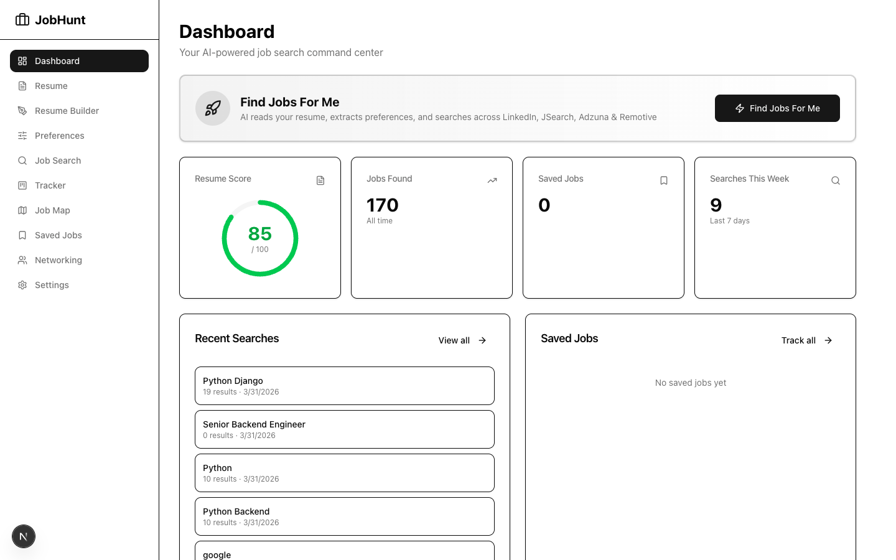
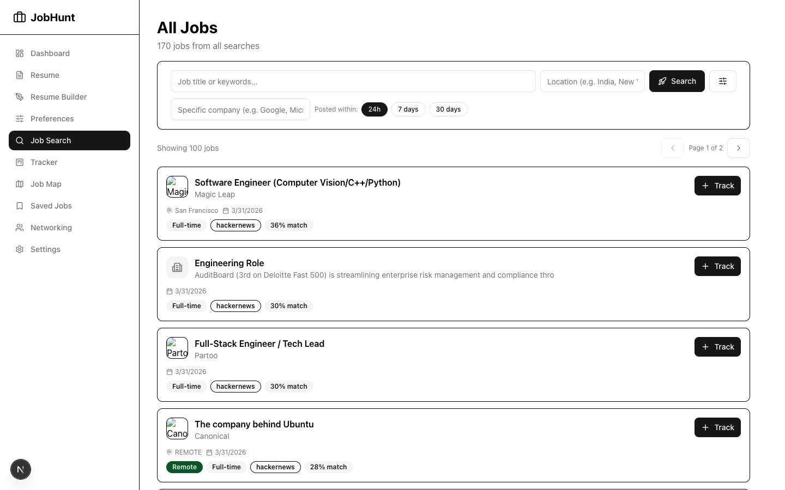
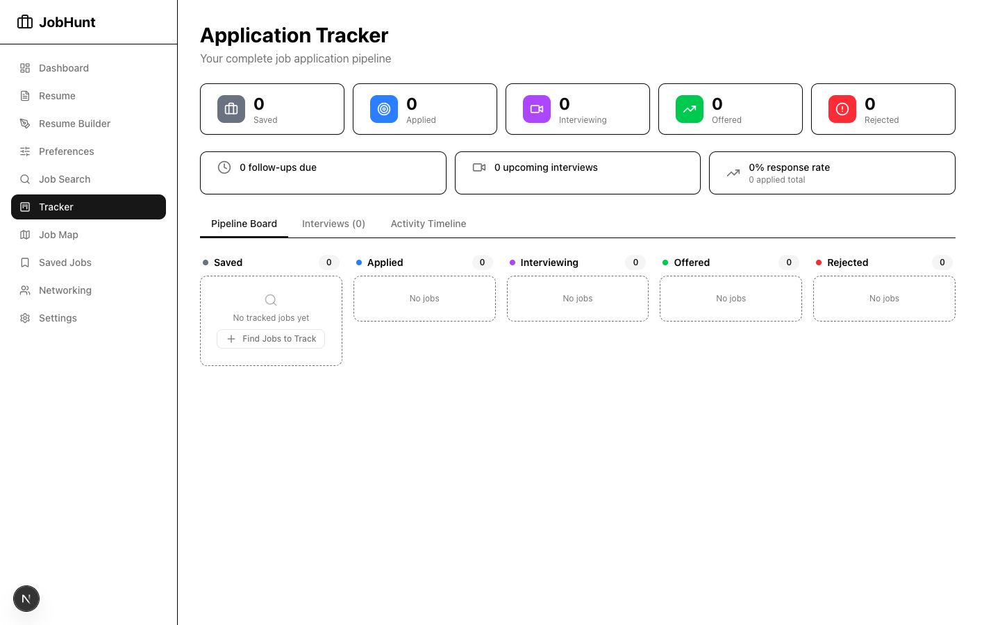
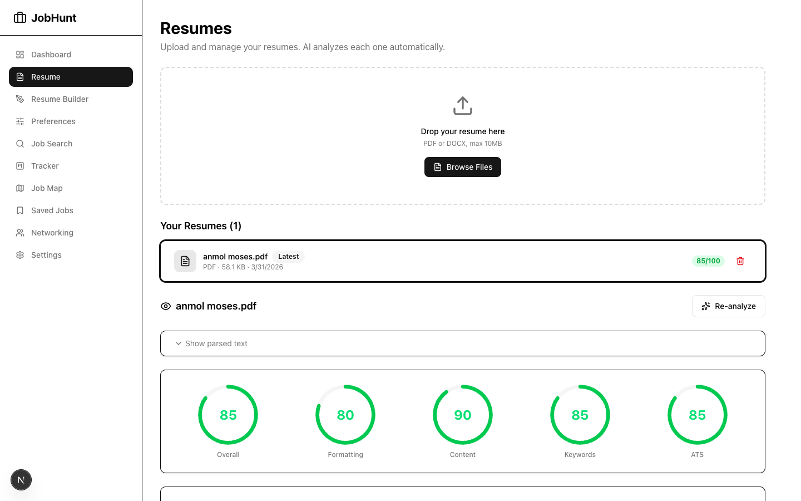
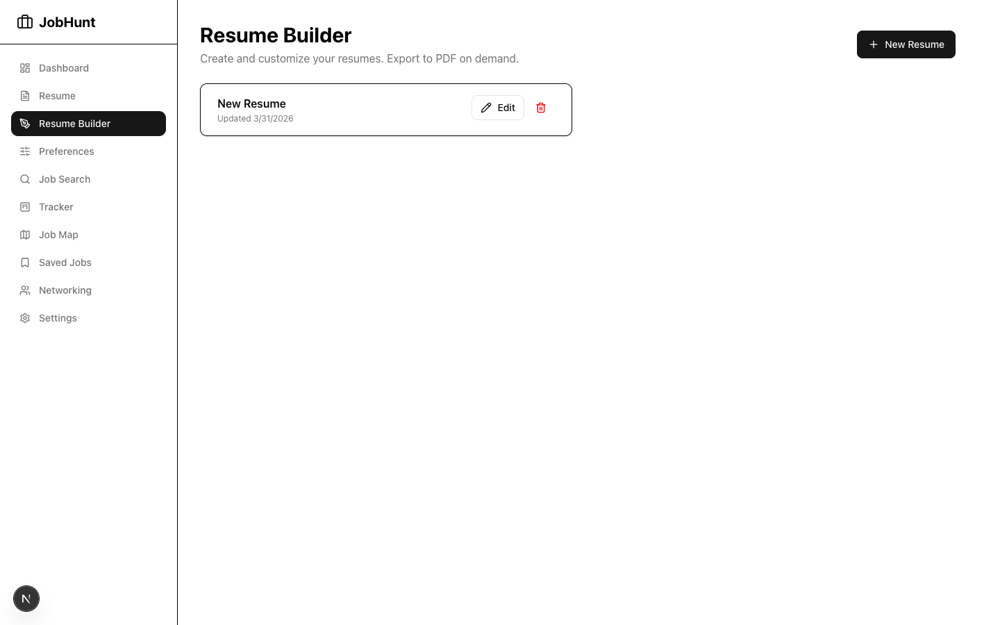
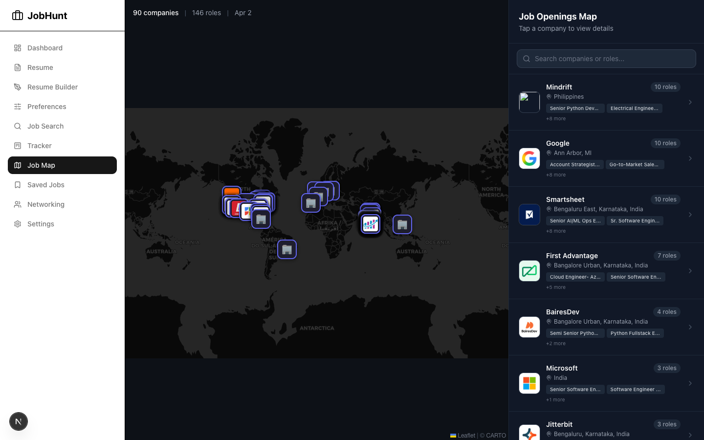
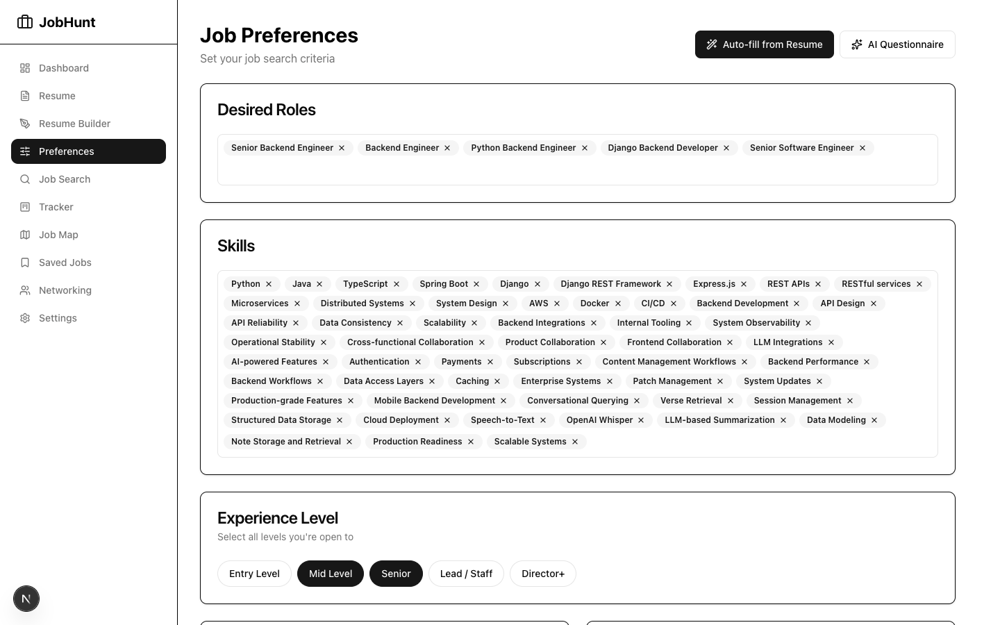
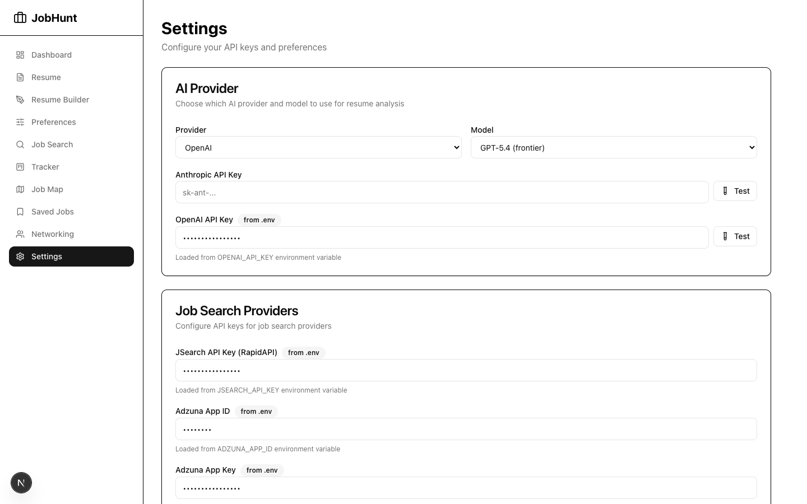

# JobHunt

AI-powered, self-hosted job hunting platform. Upload your resume, let AI find and rank jobs across 10+ providers, track applications with a Kanban board, discover networking contacts, and build tailored resumes — all from one place.

## Screenshots

### Dashboard — AI Autopilot
One click to analyze resume, extract preferences, and search across all providers.


### Job Search — 9 Providers, Smart Filtering
All jobs from every search in one place. Filter by company, provider, remote, saved status.


### Application Tracker — Kanban Board
Track applications through Saved → Applied → Interviewing → Offered → Rejected.


### Resume — AI Analysis & Scoring
Upload PDF/DOCX, get scored across formatting, content, keywords, and ATS compatibility.


### Resume Builder — Rich Text Editor + AI Tailoring
Build resumes with a rich text editor. Tailor for specific jobs with AI. Export to PDF.


### Job Map — Geographic View
See all openings on a map with company logos. Click to save, apply, or explore.


### Networking — LinkedIn Import + Force Graph
Import LinkedIn connections, visualize your network, find contacts at target companies.


### Preferences — AI Auto-Fill + Questionnaire
Multi-select experience level, work arrangement, company size. AI extracts from resume.


### Settings — API Keys + Data Management
Configure AI providers, job search APIs, networking tools. Delete data granularly.


## Features

### AI-First Job Search
- **One-click "Find Jobs For Me"** — AI reads your resume, extracts preferences, generates optimized search queries, and searches across all providers
- **10+ job providers**: LinkedIn (Crawlee), Indeed, JSearch (Google Jobs), Adzuna, Remotive, RemoteOK, Jobicy, HackerNews Who's Hiring, Greenhouse ATS, Firecrawl (web-wide)
- **Smart filtering** — excludes irrelevant jobs based on your experience level (no intern roles for senior engineers)
- **ATS keyword scoring** — each job shows how well your resume matches the job description
- **Date filtering enforced** — all providers honor your date range, with a safety-net filter in the orchestrator
- **Search configuration** — fine-grained control over providers, queries, date range, results per page in Settings

### Resume Management
- **Upload & AI Analysis** — upload PDF/DOCX, get scored on formatting, content, keywords, ATS compatibility
- **Structured parsing** — uploaded resumes are immediately AI-parsed into structured JSON (contact, experience, skills, etc.) and stored for instant reuse
- **Resume Builder** — rich text editor with sections for experience, education, skills, projects, certifications
- **Import from upload** — create a new build pre-populated from any uploaded resume (instant, no re-parsing)
- **Live preview** — side-by-side preview panel shows the exact PDF layout as you edit
- **AI Resume Tailoring** — pick a job listing and a base resume, AI rewrites to match that specific role, adds ATS keywords, and explains every change
- **Professional PDF Export** — ATS-optimized one-page layout with clean formatting via Puppeteer
- **Multiple resumes** — maintain different versions for different roles

### Application Tracking
- **Kanban board** — Saved → Applied → Interviewing → Offered → Rejected
- **Interview tracker** — schedule interviews with type (phone screen, technical, behavioral, system design, etc.), date, interviewer, meeting link, notes
- **Interview outcomes** — track pending/passed/failed/rescheduled/cancelled
- **Activity timeline** — visual history of every status change, interview, and outreach event
- **Follow-up reminders** — track follow-up dates and next steps
- **Response rate analytics** — stats dashboard with stage counts and upcoming interviews

### Company Intelligence
- **Firecrawl-first enrichment** — scrapes Crunchbase, Glassdoor, AmbitionBox for real company data
- **AI fallback** — when web data isn't available, AI analyzes the company
- **Salary data** — real market salaries from JSearch/Glassdoor with proper currency (₹, $, £, €)
- **Company profiles** — size, type, industry, headquarters, funding, valuation, revenue, growth signals, Glassdoor rating
- **Logo enrichment** — via logo.dev for companies missing logos
- **Cached results** — company intelligence cached by normalized name to avoid redundant lookups

### Networking
- **LinkedIn import** — upload your LinkedIn data export (.zip) to import connections and conversations
- **Network map** — interactive force-directed graph (react-force-graph-2d) showing companies and people with logos
- **Company matching** — fuzzy-matches LinkedIn connections to saved job companies (handles name variations like "Google LLC" vs "Google India Pvt Ltd")
- **Outreach tracking** — log outreach by channel (LinkedIn, email, phone) with status progression (planned → sent → replied → meeting scheduled)
- **Follow-up scheduling** — set and track follow-up dates for outreach
- **Happenstance integration** — find 2nd-degree contacts at target companies with mutual connection info
- **Hunter.io** — find contact emails at any company with confidence scores

### Map View
- **Geographic job map** — Leaflet-based map with company logos as markers
- **Multi-strategy geocoding** — Nominatim + Firecrawl-assisted address extraction for accurate pins
- **Company-aware geocoding** — pins at actual office locations, not just city centers
- **Sidebar with company list** — search, click to zoom, save jobs from map
- **SSE-based loading** — real-time progress updates during map data loading

### Gamification
- **XP & Levels** — 15 progressive levels from Fresh Graduate (0 XP) to Job Hunt Master (30,000 XP)
- **44 achievements** across 7 categories: application, search, networking, resume, interview, streaks, special
- **Streak tracking** — consecutive days with configurable protection window (skip 1-2 days without breaking)
- **Streak multipliers** — up to 1.75x XP for sustained activity
- **Daily goals** — configurable targets for applications, searches, and outreach with bonus XP
- **Activity heatmap** — GitHub-style contribution graph (182 days)

### Automated Job Search
- **Scheduled searches** — cron-based automated job search (default: daily at 9 AM)
- **Smart queries** — uses your top 3 desired roles with location/remote/experience filters
- **Run history** — track each automated run with jobs found, queries run, providers used, and duration

### Settings & Security
- **API keys encrypted at rest** with AES-256-GCM
- **Dual-source settings** — configure via environment variables or in-app (DB values override env)
- **AI provider selection** — choose between Claude and OpenAI with model configuration
- **Per-provider search toggles** — enable/disable individual job providers
- **Custom search queries** — add your own queries alongside or instead of AI-generated ones
- **No telemetry** — all data stored locally in SQLite, nothing sent anywhere except API calls you configure

## Quick Start

### Prerequisites
- Node.js 20+
- npm

### Local Development

```bash
# Clone the repo
git clone https://github.com/YOUR_USERNAME/jobhunt.git
cd jobhunt

# Install dependencies
npm install

# Create environment file
cp .env.example .env.local

# Generate encryption secret (paste into .env.local)
openssl rand -hex 32

# Push database schema
npm run db:push

# Start dev server
npm run dev
```

Open [http://localhost:3000](http://localhost:3000)

### Docker (One-Click Deploy)

```bash
# Create your env file
cp .env.example .env
# Edit .env with your API keys (at minimum set ENCRYPTION_SECRET)

# Build and run
docker compose up -d
```

The app runs at `http://localhost:3000`. SQLite database and resume uploads persist in Docker volumes across restarts.

To use a different port:

```bash
PORT=8080 docker compose up -d
```

The Docker image:
- Uses a multi-stage build (deps → build → production) for a lean image
- Includes system Chromium for Puppeteer PDF generation
- Auto-runs database migrations on startup
- Runs as a non-root user

## Configuration

Add your API keys in `.env.local` (local dev) or `.env` (Docker), or configure them in the Settings page:

| Key | Required | Free Tier | Purpose |
|-----|----------|-----------|---------|
| `ENCRYPTION_SECRET` | Yes | N/A | Encrypts API keys stored in database |
| `OPENAI_API_KEY` | One AI key needed | Pay-per-use | AI analysis, tailoring, preferences |
| `ANTHROPIC_API_KEY` | One AI key needed | Pay-per-use | AI analysis, tailoring, preferences |
| `JSEARCH_API_KEY` | No | 200 req/month | Google Jobs search + salary data |
| `ADZUNA_APP_ID` + `ADZUNA_APP_KEY` | No | 250 req/day | Job search |
| `HAPPENSTANCE_API_KEY` | No | Free tier | Network contact search |
| `LOGODEV_API_KEY` | No | 500K req/month | Company logos |
| `HUNTER_API_KEY` | No | 25 req/month | Email finder |
| `FIRECRAWL_API_URL` + `FIRECRAWL_API_KEY` | No | Self-hosted | Web scraping for company data + web-wide job search |

**LinkedIn, Indeed, Remotive, RemoteOK, Jobicy, HackerNews** work without API keys.

### Firecrawl (Self-Hosted Web Scraping)

Firecrawl powers company intelligence (funding, salary, Glassdoor ratings), full job description scraping, Firecrawl-based portal scanning, and a web-wide job search provider. Strongly recommended.

#### Setting Up Firecrawl

```bash
# Clone Firecrawl into the gitignored docker/ directory
git clone https://github.com/mendableai/firecrawl.git docker/firecrawl
cd docker/firecrawl

# Copy the example env (defaults work for local use)
cp apps/api/.env.example .env

# Start Firecrawl (API on port 3002, plus Redis, PostgreSQL, Playwright, RabbitMQ)
docker compose up -d
cd ../..
```

#### Connecting JobHunt to Firecrawl

**If both run in Docker** (the default), they must share a Docker network. The `docker-compose.yml` is already configured to join Firecrawl's network:

```yaml
services:
  jobhunt:
    networks:
      - default
      - firecrawl_backend

networks:
  firecrawl_backend:
    external: true
```

> **Start Firecrawl before JobHunt** so the `firecrawl_backend` network exists.

Then configure the URL in **Settings** → **Firecrawl** using the Docker service hostname:

| Setup | Firecrawl API URL |
|-------|-------------------|
| Both in Docker | `http://firecrawl-api-1:3002` |
| JobHunt local (`npm run dev`), Firecrawl in Docker | `http://localhost:3002` |
| Firecrawl Cloud | `https://api.firecrawl.dev` (+ your API key) |

> **`localhost` does not work between Docker containers.** Use the Firecrawl container name as the hostname. Find it with `docker ps` — typically `firecrawl-api-1`.

#### Verifying Connectivity

From inside the JobHunt container:

```bash
docker exec jobhunt sh -c "node -e \"fetch('http://firecrawl-api-1:3002/v1/search', \
  { method: 'POST', headers: {'Content-Type':'application/json'}, \
    body: JSON.stringify({query:'test',limit:1}) }) \
  .then(r=>r.json()).then(d=>console.log('OK:', d.success)) \
  .catch(e=>console.error('FAIL:', e.message))\""
```

#### What Firecrawl Enables

| Feature | Without Firecrawl | With Firecrawl |
|---------|-------------------|----------------|
| Company Intelligence | Salary data only (from JSearch) | Full profile: funding, valuation, Glassdoor rating, employee count, HQ, growth signals |
| Job Descriptions | Whatever the provider returns (often truncated) | Full descriptions scraped from apply URLs |
| Company Portals | Greenhouse + Lever only | Any careers page (scrapes as markdown) |
| Web Job Search | Not available | Searches the open web for job listings |
| Map Geocoding | City-level (Nominatim) | Office-level (scrapes company address pages) |

## Tech Stack

| Layer | Technology |
|-------|-----------|
| Framework | Next.js 15 (App Router, Turbopack) |
| Language | TypeScript |
| UI | React 19, Tailwind CSS v4, custom shadcn/ui-style components |
| Rich Text | Tiptap |
| Database | SQLite (better-sqlite3) + Drizzle ORM |
| AI | Claude (Anthropic SDK) + OpenAI SDK |
| Maps | Leaflet + react-leaflet + OpenStreetMap |
| Graphs | react-force-graph-2d |
| PDF | Puppeteer |
| Web Scraping | Crawlee (LinkedIn), Firecrawl (company data, portals) |
| Scheduling | node-cron |

## Architecture

```
src/
├── app/                    # Next.js App Router
│   ├── api/                # 45+ API endpoints
│   │   ├── autopilot/      # One-click AI search pipeline
│   │   ├── cron/           # Scheduled search management
│   │   ├── dashboard/      # Dashboard stats
│   │   ├── gamification/   # XP, achievements, streaks, heatmap
│   │   ├── interviews/     # Interview scheduling & outcomes
│   │   ├── jobs/           # Search, save, map, geocode, scrape
│   │   ├── linkedin/       # Import, connections, network graph
│   │   ├── outreach/       # Contact outreach tracking
│   │   ├── preferences/    # Job preferences, AI questionnaire
│   │   ├── resume/         # Upload, analyze, manage
│   │   ├── resume-builder/ # Build, preview, PDF, AI tailor
│   │   ├── settings/       # API keys, provider config
│   │   ├── tracker/        # Application pipeline & timeline
│   │   ├── company/        # Enrichment, contacts, emails
│   │   └── search-config/  # Search configuration
│   ├── dashboard/          # AI autopilot, stats, setup checklist
│   ├── jobs/               # Job search + advanced filtering
│   ├── saved/              # Saved jobs with status management
│   ├── tracker/            # Kanban board + interviews + timeline
│   ├── resume/             # Resume upload & AI analysis
│   ├── builder/            # Resume builder + editor + tailor
│   ├── preferences/        # Job preferences + AI questionnaire
│   ├── map/                # Geographic job map
│   ├── networking/         # LinkedIn import, graph, outreach
│   ├── gamification/       # XP, streaks, achievements, heatmap
│   └── settings/           # API keys + search config
├── components/
│   ├── ui/                 # Primitives (button, card, dialog, toast, etc.)
│   ├── layout/             # Sidebar navigation
│   ├── jobs/               # JobCard, JobDetailModal
│   ├── resume/             # UploadDropzone, RichEditor, AnalysisCard
│   ├── gamification/       # Widget, heatmap, achievements, streaks
│   ├── networking/         # NetworkMap (force graph)
│   ├── map/                # JobMap (Leaflet)
│   ├── preferences/        # TagInput
│   └── settings/           # GamificationSettings, SearchConfig
├── db/
│   ├── index.ts            # SQLite connection (WAL mode, foreign keys)
│   └── schema.ts           # 20 Drizzle ORM tables
├── lib/
│   ├── ai/                 # Claude & OpenAI providers, prompts, JSON repair
│   ├── jobs/               # 9 job providers, orchestrator, ATS scoring
│   ├── resume/             # Parser, analyzer, structurer, PDF generator
│   ├── company/            # Enrichment, fuzzy matching, logos, Hunter.io
│   ├── firecrawl/          # Web scraping & search client
│   ├── gamification/       # XP engine, achievements, streaks, daily goals
│   ├── happenstance/       # Network search client
│   ├── geo/                # Geocoding (Nominatim + Firecrawl)
│   ├── cron/               # Scheduled job search service & runner
│   ├── encryption.ts       # AES-256-GCM encryption
│   └── settings.ts         # Dual-source settings (env + DB)
└── types/                  # TypeScript interfaces
```

## Database

SQLite with 20 tables, WAL mode for concurrent reads, foreign keys enforced with cascade deletes.

| Table | Purpose |
|-------|---------|
| `settings` | Encrypted key-value configuration |
| `resumes` / `resumeAnalyses` | Uploaded resumes and AI scoring |
| `resumeBuilds` | User-created resumes with rich text sections |
| `jobPreferences` | Desired roles, skills, location, salary, experience level |
| `jobSearches` / `jobResults` | Search history and normalized results |
| `savedJobs` | Application tracking with status pipeline |
| `interviews` | Scheduled interviews with outcomes |
| `companyEnrichment` | Cached company intelligence |
| `linkedinImports` / `linkedinConnections` / `linkedinMessages` | LinkedIn data |
| `networkContacts` / `outreachTracking` | Networking contacts and outreach log |
| `activityLog` | Event timeline |
| `gamificationProfile` / `gamificationDailyLog` / `gamificationXpEvents` / `gamificationAchievements` | XP, streaks, achievements |
| `cronConfig` / `cronRunHistory` | Automated search scheduling and history |
| `geocodeCache` | Location geocoding cache |

## Job Providers

| Provider | Source | API Key? | Date Filtering |
|----------|--------|----------|----------------|
| LinkedIn | Crawlee CheerioCrawler (public guest API) | No | Server-side (f_TPR) |
| Indeed | ts-jobspy (scraper) | No | Server-side (hoursOld) |
| JSearch | RapidAPI (Google Jobs) | Yes | Server-side |
| Adzuna | Official API | Yes | Server-side (max_days_old) |
| Remotive | Official API | No | Client-side |
| RemoteOK | Official API | No | Client-side |
| Jobicy | Official API | No | Client-side |
| HackerNews | Algolia API | No | Thread recency check |
| Greenhouse | Public Boards API | No | Server-side |
| Firecrawl | Web search + scraping | Yes (self-hosted or cloud) | N/A |

All providers are backed by an orchestrator-level safety-net date filter.

## Scripts

| Command | Description |
|---------|-------------|
| `npm run dev` | Start dev server (Turbopack) |
| `npm run build` | Production build |
| `npm run start` | Start production server |
| `npm run lint` | Run ESLint |
| `npm run db:push` | Push schema to SQLite |
| `npm run db:generate` | Generate Drizzle migrations |
| `npm run db:migrate` | Run Drizzle migrations |
| `npm run db:studio` | Open Drizzle Studio (DB browser) |

## Security

- API keys encrypted at rest with AES-256-GCM (IV + auth tag + ciphertext)
- All data stored locally in SQLite — nothing leaves your machine except API calls you configure
- No telemetry, no analytics, no tracking
- Runs as non-root user in Docker

## License

ISC

## Acknowledgments

Built with [Claude Code](https://claude.ai/code) by Anthropic.
